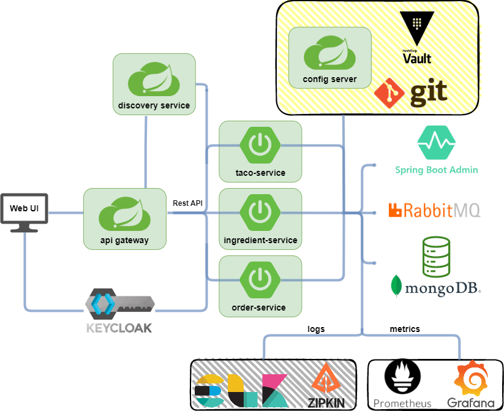

# Taco Cloud

Taco Cloud is a microservice application using Spring Boot with Java 14 and based on:

* [Spring in Action, Fifth Edition](https://www.manning.com/books/spring-in-action-fifth-edition)
* [Spring Microservices in Action - Second Edition](https://www.manning.com/books/spring-microservices-in-action-second-edition)

## Architecture Overview

[](url "title")


## Technology

1. **Eureka server** is service discovery.
2. **Spring Cloud Config** is an application that manages services configuration information using GitHub-based repository.
3. **Vault** is storage of sensitive data.
4. **Spring Cloud Gateway** provides support for routing and filtering incoming requests to microservices.
5. **KeyCloak** is authentication and authorization server.
6. **MongoDB** database used to hold the data.
7. **RabbitMQ** message bus to transport messages between services.
8. **Spring Boot Admin** is a web application, used for managing and monitoring Spring Boot applications.
9. **ELK Stack (Elasticsearch, Logstash, Kibana)** is a popular suite of tools for ingesting, viewing, and managing log files.
10. **Zipkin** is a distributed tracing system.
11. **Grafana & Prometheus** are two monitoring tools.
12. **Docker**

## How To Use

```shell
# Create executable jar file:
$ ./gradlew clean bootJar

# Pull and Create docker images and run them as docker containers:
$ docker-compose -f docker/docker-compose.yml up -d
```

&nbsp;

To make services work in local environment add next entries to host file:

```shell
127.0.0.1 keycloak
127.0.0.1 rabbitmq
127.0.0.1 vault
127.0.0.1 mongo
127.0.0.1 config-server
127.0.0.1 logstash
127.0.0.1 zipkin
```

Windows host file location:

```
C:\Windows\System32\drivers\etc\hosts
```

Linux host file location:

```
/etc/hosts
```

### Keycloak
To configure keycloak import taco-realm.json from the `./docker/config` directory
### Vault
In order not to lose data in vault when the container is restarted, vault is used in production mode.
1. Run the following command to initialize the vault instance:
```
docker exec -it [container_name] vault operator init -n 1 -t 1
```
2. Make note of unseal key 1 and initial root token.
```shell
# Example
Unseal Key 1: WMMSEDjNHSiV3pIL/OTK56XZmfp30g6rNaltj6pSv4w=
Initial Root Token: hvs.EYBi3HI5sIVO2leRDkp25hyr
```
3. Run the unseal command to decrypt the contents of the vault.
```shell
# This command has to be performed each time the vault container is restarted
docker exec -it [container_name] vault operator unseal [unseal key 1]
```
4. Login to vault with the following command using the initial root token:
```
docker exec -it [container_name] vault login [Initial Root Token]
```
5. Enable the kv secrets engine
```
docker exec -it [container_name] vault secrets enable -path=secret -version=2 kv
```
6. Update env variable located in `./docker/config/docker-compose.yml`
```
SPRING_CLOUD_CONFIG_TOKEN: [initial root token]
```